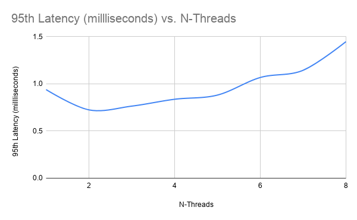
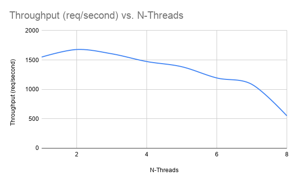
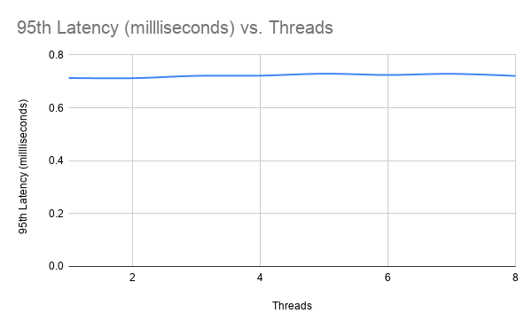
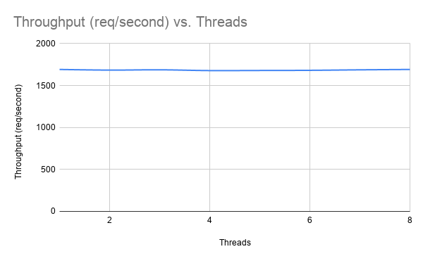

# HW6: Crank it up!
Rohan Walia. 

The codebase that I started with was Talib and Thalia's hw5. Their code was not working for me so there are bits and pieces taken out from Peter and Hunter's hw5, to fill in the gaps.

## Part 1: Multithreaded benchmark
I changed around Talib and Thalia's benchmark by first getting rid of a few structures that they had made in order to represent things and replace them with system pairs. From there I changed all of their cache's to be created and used privately by each N-thread. Otherwise I switched to high resolution clocks and tidied up the calculation of the latencies and Throughput.

## Part 2: Multithreaded server
I struggled hard with this part and don't believe that I got the multithreading to work too well, if at all. I locked up sections of the code using Mutex, but when it came to the multithreading step I don't believe that I got it correct. I believe that I miss understood the purpose of the io.run() function and the function call is not doing anything in my code.

